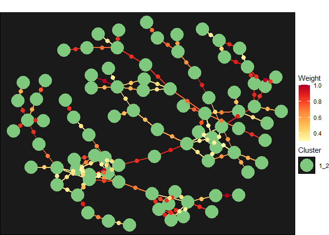

# Evaluating Linkage Results


## About

This document reviews several ways to check the “goodness” of a set of
linkage results. The evaluation metrics/approaches come in two main
flavors:

1.  Fit statistics generated via cross-validation and out of sample
    testing
2.  Summary metrics of the final linkage clusters.

The first approach is entirely quantitative, whereas the second set
requires qualitative assessment.

## Setup

Execute the pipeline, if it hasn’t already been run/completed.

``` r
targets::tar_make()
```

    ✔ skipping targets (1 so far)...
    ✔ skipped pipeline [0.61 seconds]

Load packages and helper functions.

``` r
library('data.table',quietly = TRUE, verbose = FALSE)
library('DBI')
library('glue')
library('targets')
library('ggplot2')
library('plotly')
library('hyrule')
tar_source()
```

## Fit Metrics

The `cutme` target contains three items. The first, `cutpoint`, is the
value that is used to discretize match score predictions into “match”
and “no match” decisions. The second object, `cv_metrics`, is data.frame
of fit metrics computed via several rounds of cross-validation. Finally,
`oos_metrics` is a set of fit statistics computed entirely from held out
data (i.e., data the model did not “see”).

5 metrics are returned in `cv_metrics` and \`oos_metrics:

1.  [Accuracy](https://yardstick.tidymodels.org/reference/accuracy.html):
    Fraction of predictions that were correct
2.  [Kappa](https://yardstick.tidymodels.org/reference/kap.html) (kap):
    accuracy-type metrics normalized by chance expectations.
3.  [F
    Measure](https://yardstick.tidymodels.org/reference/f_meas.html?q=f_meas#null)
    (f_meas): Harmonic mean of precision and recall
4.  [Mean log
    loss](https://yardstick.tidymodels.org/reference/mn_log_loss.html)
    (mn_log_loss)
5.  [Area under the receiver operator
    curve](https://yardstick.tidymodels.org/reference/roc_auc.html)
    (roc_auc): Approximately how good the model is at predicting high
    scores for true matches relative to true negatives. [See also this
    link.](https://developers.google.com/machine-learning/crash-course/classification/roc-and-auc)

The table below shows the out of sample fit metrics. In general, you
want all metrics except for mean log loss to be as close to 1 (mean log
loss should be as low as possible).

``` r
knitr::kable(tar_read(cutme)$oos_metrics[, .(.metric, .estimate = round(.estimate,2))])
```

| .metric     | .estimate |
|:------------|----------:|
| accuracy    |      0.94 |
| kap         |      0.89 |
| f_meas      |      0.94 |
| mn_log_loss |      0.29 |
| roc_auc     |      0.94 |

## Missed Predictions

It is useful to manually review the labeled pairs (training and test)
that the model gets wrong. Qualitative review of these data can suggest
approaches to improve the model such as new training data, new predictor
variables, incorrectly manually labelled data, and more.

``` r
# Load the pairs
pairs = lapply(tar_read(test_train_split), function(x) setDT(arrow::read_parquet(x)))
pairs = rbind(pairs[[1]][, status := 'test'], pairs[[2]][, status := 'train'])

# Load the models
model = tar_read(model)

# Make predictions
ppreds = predict(model, pairs)

# Results
res = pairs[, .(id1, id2, pair, 
                status, final = ppreds$final, result = ppreds$final >= tar_read(cutme)$cutpoint)]
res[, correct := pair == factor(result, c(F,T), c(0,1))]

# Subset to incorrect, and screen out examples that are obviously
# "purposeful" training misclassification
incorrect = res[correct == F & final >.2 & final <.8]

# Report correctness, by status
knitr::kable(res[, .N, keyby = .(status, correct)])
```

| status | correct |   N |
|:-------|:--------|----:|
| test   | FALSE   |   6 |
| test   | TRUE    | 102 |
| train  | FALSE   |   7 |
| train  | TRUE    | 610 |

An example misclassified pair is presented below. Because these data are
fake, the example data below is not particularly illustrative, but the
underlying process of examining the labeled pairs the linkage process
got wrong will be useful.

``` r
data = setDT(arrow::read_parquet(tar_read(data)))
example = data[clean_hash %in% c(incorrect[1,id1], incorrect[1, id2])]
knitr::kable(t(example), 
             caption = paste0('Example misclassification, score: ', 
                              incorrect[1,round(final,2)],
                              ' | pair = ', incorrect[1, pair]))
```

|  |  |  |
|:---|:---|:---|
| source_system | System 2 | System 1 |
| source_id | 0_14507 | 0_19515 |
| first_name_noblank | ARLEN | MADELINE |
| middle_name_noblank | J | K |
| last_name_noblank | WEI | RONO |
| sex_clean | M | F |
| dob_clean | 1952-08-06 | 2000-02-02 |
| clean_hash | d551ff732e3a8d126d136bacd3715170 | 05f20fff7aeb6de92269d5306a401f34 |

Example misclassification, score: 0.3 \| pair = 1

## Network Metrics

The main output of the linkage process is a series of networks
consisting of records that are all linked together in some way.
Reviewing these networks, especially ones that are large and sparse, can
reveal opportunities for model and training data improvement. For
example, large and sparse clusters may indicate new junk names or
numeric identifiers (e.g., ssn).

The second part of the `components` target contains a summary of all the
networks (including ones created by subdivision) induced as part of the
linkage process. The code below loads the target, sorts the results
based on final density and subsets to a minimum size.

``` r
summ = setDT(arrow::read_parquet(tar_read(components)[2]))
setorder(summ, +final_density)

# Clusters that are large and low density
knitr::kable(head(summ[final_size > 10]))
```

| s1_comp_id | s1_density | s1_size | s2_comp_id | s2_density | s2_size | final_comp_id | final_density | final_size |
|:---|---:|---:|:---|---:|---:|:---|---:|---:|
| 1 | 0 | 5824 | 1_7 | 0.017 | 138 | 1_7 | 0.017 | 138 |
| 1 | 0 | 5824 | 1_31 | 0.021 | 121 | 1_31 | 0.021 | 121 |
| 1 | 0 | 5824 | 1_28 | 0.022 | 109 | 1_28 | 0.022 | 109 |
| 1 | 0 | 5824 | 1_70 | 0.023 | 112 | 1_70 | 0.023 | 112 |
| 1 | 0 | 5824 | 1_74 | 0.023 | 91 | 1_74 | 0.023 | 91 |
| 1 | 0 | 5824 | 1_37 | 0.024 | 108 | 1_37 | 0.024 | 108 |

``` r
# High density clusters
knitr::kable(tail(summ[final_size > 10]))
```

| s1_comp_id | s1_density | s1_size | s2_comp_id | s2_density | s2_size | final_comp_id | final_density | final_size |
|:---|---:|---:|:---|---:|---:|:---|---:|---:|
| 1 | 0.000 | 5824 | 1_72 | 0.121 | 22 | 1_72 | 0.121 | 22 |
| 1 | 0.000 | 5824 | 1_75 | 0.169 | 17 | 1_75 | 0.169 | 17 |
| 1 | 0.000 | 5824 | 1_51 | 0.182 | 11 | 1_51 | 0.182 | 11 |
| 131 | 0.182 | 12 | NA | NA | NA | 131 | 0.182 | 12 |
| 4 | 0.182 | 12 | NA | NA | NA | 4 | 0.182 | 12 |
| 1 | 0.000 | 5824 | 1_20 | 0.292 | 16 | 1_20 | 0.292 | 16 |

The `retrieve_network_info` and `vis_network` functions can be used to
visualize the computed networks. Because this document is static, the
`vis_network` call has `return_data = T` and as a result a static
(gg)plot is produced. Interactive users should instead use
`return_data = F` and `vis_network` will return an interactive plotly
graph where each node has a tooltip containing the information specified
by the `tooltip_cols` argument.

``` r
# Get a cluster's details
net = retrieve_network_info(net_id_val = '1_2',
                      net_id_col = DBI::Id(column = 'final_comp_id'),
                      net_tab = tar_read(components)[1],
                      result_tab = unlist(c(tar_read(preds), tar_read(fixed))),
                      cutpoint = tar_read(cutme)[1], 
                      identifier_tab = tar_read(data))

# To produce an interactive visualization:
# vis_network(
#   net$nodes, 
#   net$edge, 
#   tooltip_cols = c('first_name_noblank', 'last_name_noblank', 
#                    'dob_clean', 'clean_hash'),
#   labels = 'final_comp_id',
#   return_data = F)


vis = vis_network(
  net$nodes, 
  net$edge, 
  tooltip_cols = c('first_name_noblank', 'last_name_noblank', 
                   'dob_clean', 'clean_hash'),
  labels = 'final_comp_id',
  return_data = T)
```

    Registered S3 method overwritten by 'GGally':
      method from   
      +.gg   ggplot2

    Warning in geom_point(aes(x = x, y = y, text = text, fill = factor(lab)), :
    Ignoring unknown aesthetics: text

    Warning in geom_point(data = edat, aes(x = midX, y = midY, text = weight, :
    Ignoring unknown aesthetics: text

``` r
plot(vis[[1]])
```


