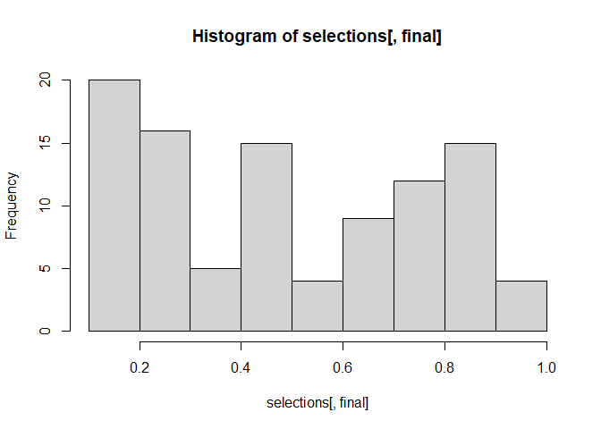

# Making Training Pairs


- [Starting fresh](#starting-fresh)
- [hyrule::matchmaker()](#hyrulematchmaker)
- [Ideas for selecting training data
  pairs](#ideas-for-selecting-training-data-pairs)

## Starting fresh

Any good record linkage workflow requires manually labeled pairs of
records as estimating metrics of model performance and deciding on a
cutoff threshold requires manually evaluating pairs. Machine learning
linkage pipelines have an additional use for these pairs: fitting the
match score model(s).

When beginning a new project, manually labeled pairs for the input
datasets are probably not available and need to be created. A good way
to select pairs for manual evaluation is to use a model or metric that
can serve as an approximate match score and select pairs across the
score spectrum. These initial match scores can be estimated through a
few (non-comprehensive) mechanisms:

1.  Use predictions from an existing model, either one from another
    project and/or one trained on fake data. As long as the data
    cleaning/variable creation approach is sufficiently similiar than
    the resulting match scores will provide a good first match score
    estimate. If you are lucky, then maybe that is all you need. The
    overall idea is to do some bootleg transfer learning.
2.  Use predictions from a probabilistic model like splink. Worst case,
    you can use the results to generate some training data (or maybe
    even use it as a predictor). Best case, the probabilistic model is
    good enough for your use case and you are done with the project
    early.
3.  Compute some distance metrics on key variables (e.g., jaro-winkler
    distance on first name and last name), scale them, and take an
    average. Assuming the valences are aligned, you’ll have a good
    enough starting point.

The goal is to generate pairs across the match score spectrum to fit a
first model; about 100 evaluated pairs is enough to get started. While
you can get fancy with how you select the pairs for manual evaluation,
random sampling within quantiles is usually good enough.

Note: This section assumes you have already completed a first draft of
the blocking scheme and therefore have a universe of possible pairs to
evaluate. When computing approximate match scores, you don’t need to
assess all the pairs nor do so in a totally random way. Mostly, you want
to evaluate enough pairs to represent the spectrum of possible match
scores (as opposed to the distribution of actual match scores).

### Using a previously fit model

To use a previously fit model that used the example workflow structure,
you will need to make the following changes to the workflow:

1.  Make sure the variable creation and dataset cleaning functions are
    the same/similar.
2.  Remove/comment out the following targets:
    1.  `train_input`
    2.  `train_test_data`
    3.  `training_hash`
    4.  `test_train_split`
    5.  `screener`
    6.  `tfolds`
    7.  `submod_*`
    8.  `model`
    9.  `cv_co_*`
    10. `fixed`
    11. `cutme`
    12. `components`
    13. `cutme_path`
3.  Overwrite the `model_path` target to point to the previously fit
    model

With these changes, you should be able to run the workflow up to the
`preds` target.

### An example of selecting initial pairs

``` r
library('targets')
library('data.table')

preds = tar_read(preds) |>
  lapply(arrow::read_parquet) |>
  data.table::rbindlist()

# Select 10 pairs from each quantile
cuts = seq(0, .8, .2)
n = 20
selections = lapply(cuts, function(s){
  a = preds[final >= s & final <s+.2]
  a[sample(seq_len(.N), n), .(id1, id2, final)]
})

selections = rbindlist(selections)

knitr::kable(head(selections))
```

| id1                              | id2                              | final |
|:---------------------------------|:---------------------------------|------:|
| e1f76eb9e884d5dae9424a6340ad4a4b | f9b37cc13e357654a9253120a01f5762 | 0.119 |
| 2f744b27f7e7709ddcc676ed703f1262 | de5e63f40df2427a1c33d8f57aec72d4 | 0.139 |
| 4c5b3361447e70748a8ca5e2d4637551 | fb226e27c0af282894f6d8369b46610a | 0.164 |
| 998659a1e449f27115b2ec52eb2de607 | aaf08642601fa5957808b6f4844b1bc0 | 0.162 |
| 76d5c168d6b35d61b88b3efd4d63c6cc | 9ec04b526db516d267713f42ff04a6a8 | 0.120 |
| d68dd349b2956bc8352077c04c297ce3 | ed4f33d4a5b2807990c8bb02b7ec31ac | 0.139 |

``` r
hist(selections[, final])
```



## hyrule::matchmaker()

The `matchmaker` function loads and displays a shiny app to facilitate
the labeling of pairs.

``` r
hyrule::matchmaker(
  p = selections,
  data1 = arrow::read_parquet(tar_read(data)),
  data2 = arrow::read_parquet(tar_read(data)),
  data_id1 = 'clean_hash',
  data_id2 = 'clean_hash'
  
)
```


The app is organized into two panels, a Control Panel on the left ~1/3rd
of the app and a Comparison Panel on the right ~2/3rds. A detailed
description of the app is provided below, but the general workflow to
use is:

1.  Load the pairs, data1, and data2 files (either through the button or
    when calling `hyrule:matchmaker()`.
2.  Make sure the ID variables for `data1` and `data2` are set properly
    (being able to see a sensible table in the Comparison Panel is a
    good indication that its been set up properly).
3.  Use the “No Match!”, “Flag”, and “Match!” buttons to label each
    pair.
4.  Save the results.

#### Control Panel

1.  The load data section of buttons opens file pickers. These
    correspond to the `p`, `data1` and `data2` arguments in the
    `matchmaker` function. The pairs data frame (in this example,
    `selections`) must contain at least two columns: `id1` and `id2`
    referencing an id field (e.g. `clean_hash`) in `data1` and `data2`.
2.  The Navigation section includes a numeric input box that controls
    the pair number to review in the Comparison Panel.
3.  The “Select cols” section includes two drop down selectors. The
    first indicates which column in `Data1` (passed through the `data1`
    argument or selected via `Select Data1 File` button) corresponds to
    the `id1` column in the pairs data set. The second selector does the
    same thing, but for `Data2`. The “Comparison Variables” check box
    list controls what variables are visualized in the data table in the
    Comparison Panel.
4.  The Save Results button generates a CSV file for saving/download
    that includes all the manual labeling conducted up to that point.

#### Comparison Panel

1.  There are two tabs within the Comparison Panel. The first, “Make
    Matches” provides information so that a user can go pair by pair and
    assess whether or not the pair under evaluation is a match. The
    second tab, “Review Results”, is the table of results so far.
2.  The status text will reflect the current label of the pair as
    determined by the `pair` column in the `pairs` data frame. NA means
    the pair has not been evaluated, 0 means no match, 1 means match,
    and -1 means cannot determine/flag.
3.  The color coded table displays the values for each record in the
    pair, with a row per variable (as controlled by the Comparison
    Variables checkbox list in the Control Panel). Purple means the two
    values do not exactly match, green indicates and exact match, and
    orange (not shown) indicates unknown match (e.g., one value might be
    NA).
4.  The “Previous” and “Next” buttons, along with the index numeric
    input in the Control Panel, control the iteration through the pairs
    for evaluation.
5.  The “No Match!”, “Flag”, and “Match!” buttons classify the displayed
    pair as a non-match (0), unknown/cannot determine (-1), and
    match (1) respectively. After labeling the pair, the app shows the
    next pair.
6.  The pair \| N table is a summary of how pairs have been classified
    so far.
7.  The Match Breakdown section shows, where relevant, the file paths
    that have been loaded.

## Ideas for selecting training data pairs

While stratified random sampling is a good way to start generating a
training dataset, there are other approaches of selecting pairs to
manually label that should be used as a project matures:

1.  Ensure some minimal amount of pairs from each system and the
    connections between them. For example, given systems A, B, and C,
    you’ll want a minimum amount of labeled pairs between A - B, B - C,
    and A - C. The so called “minimum amount” depends on the project,
    but 20 is a decent place to start.
2.  Examine pairs that have a high difference in match score between
    version to version.
3.  Ensure some minimal amount of pairs based on record
    characteristics - especially when you think those characteristics
    might correlate with how your predictor variables work. For example,
    Hispanic folks often have a distinct convention for last names – and
    a good model should have training data reflecting those permutation.
    This principle can apply to other characteristics (twins, name
    changes, etc.) as well. The model will be better if it has “hard”
    cases to learn from.
4.  Select pairs from large but low density networks (usually identified
    from a previous version of results).
5.  Select pairs near the previous cutpoint. These will likely be “hard”
    cases.
